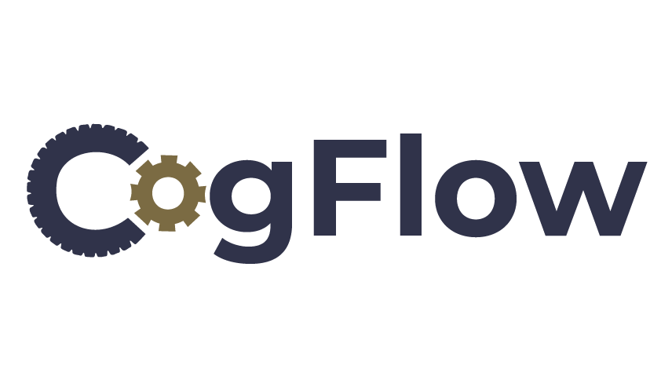

<p align="center">
  
</p>

# CogFlow Builder

CogFlow Builder is a static (non-bundled) web app for authoring **CogFlow JSON configs** (task defaults + a timeline of components/blocks). Those configs are executed by the CogFlow Interpreter via **jsPsych** (commonly inside **JATOS**).

This repo is intentionally plain HTML/CSS/JS loaded via classic `<script>` tags (globals; no `import`/`export`).

## Repositories

- Builder repo: https://github.com/KSalibay/cogflow-builder-app
- Interpreter repo: https://github.com/KSalibay/cogflow-interpreter-app

## Quickstart

### Run locally

- Use VS Code Live Server on [index.html](index.html)
- If caching gets in your way, bump the `?v=...` cache-buster on local `<script>` tags in [index.html](index.html)

### Run inside JATOS

This repo includes a JATOS wrapper page: [index_jatos.html](index_jatos.html).

Recommended study-assets layout for a Builder component:

- Component HTML entry: `index_jatos.html`
- The Builder app directory under the component: `builder/` (so the wrapper fetches `/builder/index.html` while keeping the top-level page at `/start`)

Why the wrapper exists:

- JATOS often applies stricter CSP to static asset routes; the wrapper keeps the top-level document at `/start` (typically `+nocsp`) and injects Builder scripts sequentially.

## What this app does

CogFlow Builder is an authoring tool for generating runnable CogFlow configs.

Key features:

- Task-scoped component library (task-appropriate components and fields)
- Blocks (compact “generate many trials” representation with per-trial sampling)
- Preview modal for many components (including representative Block sampling)
- Timeline authoring ergonomics:
  - Component-level **Duplicate Below** action
  - Stable row alignment and truncation behavior for long timeline labels
  - Structural timeline rails for looping and randomization:
    - Left rail (blue): draw loop ranges (loop start/end markers)
    - Right rail (purple): draw randomization ranges (randomize start/end markers)
- Export paths:
  - Local JSON download
  - Token Store export (Cloudflare Worker; optional R2 assets) + JATOS Component Properties bundle generation
  - Optional SharePoint / OneDrive export via Microsoft Graph (advanced)
- Asset handling:
  - `asset://...` placeholders during authoring
  - Upload cached assets during export and rewrite references to hosted URLs
  - Optional “Upload Assets (folder)” tool to reference images by filename
- Data collection toggles and helper components (reaction time, accuracy, correctness, eye tracking, mouse tracking)
- Theming (manual light/dark toggle; persisted locally via localStorage)
- Accessibility Mode (persisted locally)

## Core concepts

### What the Builder outputs

The Builder’s exported JSON is intentionally lightweight and matches what [src/JsonBuilder.js](src/JsonBuilder.js) generates.

High-level shape (abridged):

```json
{
  "ui_settings": { "theme": "dark" },
  "experiment_type": "trial-based",
  "task_type": "rdm",
  "data_collection": {
    "reaction-time": true,
    "accuracy": true,
    "correctness": false,
    "eye-tracking": false
  },
  "timeline": [ /* components and blocks */ ]
}
```

Key ideas:

- **Task type** controls which task-scoped component library is available.
- **Experiment type** controls whether the Interpreter treats the timeline as discrete trials (`trial-based`) or a continuous session (`continuous`).
- **Timeline** is a list of components and (optionally) Blocks.

### Components vs Blocks

- **Components** are single timeline items (instructions, trials, SOC subtasks, etc.).
- **Blocks** are a compact “generate many trials” representation. In preview, Blocks are rendered by sampling a representative trial; at runtime, the Interpreter expands Blocks to trials/frames according to the block definition.

The timeline also supports structural marker ranges (created from the Timeline rails, not from the normal library picker):

- **Loop ranges** (left/blue rail): wrap enclosed sibling items and repeat them for the configured iteration count.
- **Randomization ranges** (right/purple rail): shuffle only the enclosed sibling items once per run/participant.

Immutability rule for non-group items:

- Items not enclosed by a randomization range keep their authored order.
- Example: `A, [randomize B C], D` runs as `A, (B/C shuffled), D`; `A` and `D` stay fixed.

Block export example (abridged):

```json
{
  "type": "block",
  "block_component_type": "rdm-trial",
  "block_length": 100,
  "sampling_mode": "per-trial",
  "parameter_windows": [
    { "parameter": "coherence", "min": 0.2, "max": 0.8 },
    { "parameter": "speed", "min": 4, "max": 10 },
    { "parameter": "lifetime_frames", "min": 3, "max": 8 }
  ],
  "parameter_values": {
    "direction": [0, 180],
    "dot_color": "#FFFFFF"
  }
}
```

Continuous-mode block sizing supports two authoring modes:

- `by_frames` (legacy): use `block_length` directly.
- `by_duration`: set `block_duration_seconds`; Builder derives `block_length = round(block_duration_seconds * frame_rate)`.

Builder-side validation and save-time clamping enforce experiment-wide caps:

- For continuous experiments, `block_duration_seconds` cannot exceed experiment `duration`.
- Derived or direct `block_length` cannot exceed `duration * frame_rate`.

For Block list fields that accept numeric CSV values (for example direction/digit option lists), Builder also supports integer range shorthand:

- `1-4` is expanded to `1,2,3,4`
- `4-1` is expanded to `4,3,2,1`
- Negative ranges like `-3--1` are supported

This expansion happens in the Builder before export, so exported config JSON stores explicit values rather than dash shorthand.

For RDM Blocks, `lifetime_frames` now uses the same per-trial sampling path as `coherence` and `speed`. The Builder exports it under `parameter_windows`, the Interpreter samples it while expanding the Block to generated trials, and the sampled value is passed through to the RDM renderer for the actual dot update loop.

## Supported tasks

The Builder supports these `task_type` values via the **Task Type** dropdown:

- `rdm` — Random Dot Motion (RDM)
- `flanker` — Flanker
- `sart` — Sustained Attention to Response Task (SART)
- `stroop` — Stroop
- `emotional-stroop` — Emotional Stroop (2–3 labeled word lists)
- `simon` — Simon
- `pvt` — Psychomotor Vigilance Task (PVT)
- `task-switching` — Task switching (letters/numbers or custom token sets; explicit/position/color cueing)
- `gabor` — Gabor patch
- `mot` — Multiple Object Tracking (MOT)
- `nback` — N-back (trial-based and continuous)
- `soc-dashboard` — SOC desktop multitasking session (continuous-mode)
- `continuous-image` — Continuous Image Presentation (CIP) session (continuous-mode)

There is also `task_type: "custom"` intended for advanced/manual use (generic components + tracking only).

For a plain-English task catalog you can use to track authorship and design ideas, see [docs/task_feature_catalog.md](docs/task_feature_catalog.md).

## Component library and schemas

The Builder’s modal editors and validations are driven by plugin schemas in:

- [src/schemas/JSPsychSchemas.js](src/schemas/JSPsychSchemas.js)

The generated snapshot of those schemas (including parameter tables) is:

- [docs/reference/plugins/plugin_schema_reference.md](docs/reference/plugins/plugin_schema_reference.md)

Recent schema additions include Gabor cue/value learning controls such as:

- `gabor_spatial_cue_validity_probability`
- `gabor_value_target_value`
- `gabor_reward_availability_high`
- `gabor_reward_availability_low`
- `gabor_reward_availability_neutral`

How to regenerate that snapshot:

- Browser generator (no Node required): [tools/generate_plugin_refdocs.html](tools/generate_plugin_refdocs.html)
- Python generator (writes the snapshot file above): `python tools/generate_plugin_refdocs_quickjs.py`
- Optional Node generator (writes per-plugin files): `node tools/generate_plugin_refdocs.js`

Scope note (important): the refdoc snapshot covers **modal/plugin schemas**. Some timeline items and features are implemented via Builder-side helper logic and/or special-case export code (for example, DRT start/stop items and Continuous Image Presentation URL list derivation). Those pieces are documented in this README even if they are not listed in the plugin schema refdocs.

## Preview

The Builder includes a Preview modal for many components, including representative Block sampling.

Preview supports (examples; not exhaustive):

- Trial-based renderers for task components like `stroop-trial`, `simon-trial`, and `pvt-trial` (PVT preview includes a lightweight timing simulation)
- SOC components and subtasks with interactive previews (no data logging)

## Timeline components

The timeline is authored in the UI and serialized from DOM `dataset.componentData`.

Below is a “what you can add to the timeline” inventory by task type. For parameter-level details, use the generated schema snapshot listed above.

### Common components (all tasks)

- Instructions:
  - `instructions` (renders/export as `html-keyboard-response`)
- Generic stimulus/survey:
  - `html-keyboard-response`
  - `html-button-response`
  - `image-keyboard-response`
  - `survey-response`
- Tracking (only shown when enabled under **Data Collection**):
  - `eye-tracking`
  - `eye-tracking-calibration-instructions` (preface screen)
  - `mouse-tracking`

### RDM components (`task_type: "rdm"`)

- `rdm-trial`
- `rdm-practice`
- `rdm-adaptive`
- `rdm-dot-groups`
- `block` (block_component_type can be `rdm-trial`, `rdm-practice`, `rdm-adaptive`, `rdm-dot-groups`, `html-keyboard-response`, `html-button-response`, or `image-keyboard-response`)
  - For `image-keyboard-response` blocks, you can provide `stimulus_images` as a comma/newline-separated list to sample from across generated trials.
  - RDM Blocks can sample `lifetime_frames` per generated trial in addition to `coherence` and `speed`, which allows dot lifetime to vary within and across Blocks.
  - RDM Blocks also expose timing windows for `stimulus_duration`, `response_deadline`, and `inter_trial_interval` directly in the Block modal.
  - Direction transitions within an RDM Block can be controlled with `direction_transition_mode` (`random_each_trial`, `every_n_trials`, `exact_count`) plus `every_n`/`count` controls.
  - `rdm-dot-groups` Blocks can optionally enable dynamic target-group switching. When enabled, the Builder exposes an `every N-N frames` field (for example `120-240`) that tells the runtime to alternate the response target between group 1 and group 2 at random frame intervals sampled from that inclusive range.
  - When `rdm-dot-groups` uses `cue_border_mode: target-group-color`, the cue border follows the currently active target group during those runtime switches.
  - `rdm-dot-groups` Blocks also support a dependent direction of movement mode. When `dependent_direction_of_movement_enabled` is enabled, the independent `group_1_direction_options` / `group_2_direction_options` fields are replaced by `dependent_group_1_direction_options` (range or list for group 1) and `dependent_group_direction_difference_options` (offset list for group 2). At runtime, group 1's direction is sampled from the first field and group 2's direction is computed as `(group_1_direction + sampled_difference) mod 360`. For example, with group 1 range `0-15` and difference list `180,270`, the two groups can move at pairs such as `{0, 270}` or `{10, 190}`.

### Gabor components (`task_type: "gabor"`)

- `gabor-trial`
- `block` (block_component_type can be `gabor-trial`, `gabor-quest`, or `gabor-learning`)
  - Gabor blocks support cue/value learning controls including cue validity probability, target-value coupling, and cue-conditioned reward availability.

### Flanker components (`task_type: "flanker"`)

- `flanker-trial`
- `block` (block_component_type can be `flanker-trial`)

### SART components (`task_type: "sart"`)

- `sart-trial`
- `block` (block_component_type can be `sart-trial`)
  - SART Blocks can preserve the full digit option list while also exporting `nogo_probability`; preview/runtime trial generation uses that probability to determine no-go frequency.

### Stroop components (`task_type: "stroop"`)

- `stroop-trial`
- `block` (block_component_type can be `stroop-trial`)

### Emotional Stroop components (`task_type: "emotional-stroop"`)

- `emotional-stroop-trial`
- `block` (block_component_type can be `emotional-stroop-trial`)
  - Blocks can export structured `word_lists` and record the selected list in per-trial fields `word_list_label` / `word_list_index`.

### Simon components (`task_type: "simon"`)

- `simon-trial`
- `block` (block_component_type can be `simon-trial`)

### PVT components (`task_type: "pvt"`)

- `pvt-trial`
- `block` (block_component_type can be `pvt-trial`)

### Task Switching components (`task_type: "task-switching"`)

- `task-switching-trial`
- `block` (block_component_type can be `task-switching-trial`)

Task Switching authoring model:

- The **Experiment Settings** panel for Task Switching defines experiment-wide defaults exported under `task_switching_settings`.
  - Stimulus set:
    - `letters_numbers`: built-in vowel/consonant and odd/even scoring
    - `custom`: two per-task 2AFC token sets (`tasks[0]` + `tasks[1]`), each with `category_a_tokens` / `category_b_tokens`
  - Cueing:
    - `cue_type: explicit | position | color`
    - Explicit cue fields: `task_1_cue_text`, `task_2_cue_text`, `cue_font_size_px`, `cue_duration_ms`, `cue_gap_ms`, `cue_color_hex`
    - Position cue fields: `task_1_position`, `task_2_position`
    - Color cue fields: `task_1_color_hex`, `task_2_color_hex`

- Creating a new Task Switching **Block** uses those experiment-wide cueing defaults to seed the block-level `ts_*` parameters.

Runtime behavior notes (Interpreter):

- The runtime displays a **combined stimulus** (task-1 token + task-2 token, e.g. `A 2`) on every trial.
- Correctness uses the **task-relevant token** (letters task uses the letter; numbers task uses the number) and your configured token sets / keys.

### N-back components (`task_type: "nback"`)

- `nback-trial-sequence`
  - Trial-based: generates an $n$-back sequence and is expanded into `nback-block` trials by the Interpreter.
  - Continuous: compiled into a continuous N-back stream (Interpreter plugin `nback-continuous`).
- `nback-block`
  - Trial-based N-back trial item (usually generated from a sequence/block).
- `block` (block_component_type can be `nback-block`)
  - Acts as an N-back generator with a `block_length` and `parameter_values` (advanced authoring).

### SOC Dashboard components (`task_type: "soc-dashboard"`)

- `soc-dashboard` (SOC desktop “session container”)
- `soc-dashboard-icon` (desktop icon; distractor clicks)
- Subtasks (composed into `soc-dashboard.subtasks[]` on export):
  - `soc-subtask-sart-like` (log triage Go/No-Go)
  - `soc-subtask-nback-like` (alert correlation)
  - `soc-subtask-flanker-like` (traffic spikes monitor)
  - `soc-subtask-wcst-like` (email sorting / WCST-like)
  - `soc-subtask-pvt-like` (incident alert monitor / PVT-like vigilance)

### Continuous Image Presentation components (`task_type: "continuous-image"`)

- `block` whose inner component type is `continuous-image-presentation`

## Assets

### Local assets while authoring (`asset://...`)

Some parameters support choosing local files.

- While editing, the Builder caches files locally and writes `asset://<componentId>/<field>` placeholders into JSON.
- On export to a remote destination (Token Store or SharePoint), the Builder uploads cached files and rewrites references to hosted URLs.
- On local JSON download, `asset://...` placeholders are preserved (you must host those files yourself for runtime).

### Upload Assets (folder) → refer to images by filename

The **Upload Assets** tool uploads a local folder and stores a **filename → URL** index in browser storage (scoped to your export code + task type).

- After uploading, you can reference images in parameters by filename (e.g., `b1.png`) instead of pasting full URLs.
- The Preview modal also resolves bare filenames via the saved index.

This works for (examples):

- `image-keyboard-response` components (`stimulus`, `stimulus_image`)
- `image-keyboard-response` Blocks (`stimulus_image` or `stimulus_images`)

Note: the filename → URL mapping is stored in the browser. If you clear site data or switch browsers, re-run **Upload Assets**.

## Export workflows

### Local download

- Exports a JSON file directly.
- Keeps `asset://...` placeholders as-is.

### Token Store export (recommended for JATOS)

The default “demo-ready” workflow is:

1. Run the Builder (locally or in JATOS)
2. Click **Export → Token Store**
3. The Builder uploads the JSON and any cached assets, then shows an overlay containing a **JATOS Component Properties** blob you can paste into the Interpreter component

Reliability notes:

- The Builder saves a local “export snapshot” in browser storage when you export.
- When running inside JATOS, the Builder also uploads the exported JSON snapshot as a JATOS result file (best-effort) so the config is preserved server-side even if the Token Store is unreachable.

This repo includes a Cloudflare Worker implementation in:

- [token-store-worker/](token-store-worker/)

#### Token Store base URL (important)

By default, [index.html](index.html) ships with a demo `window.COGFLOW_TOKEN_STORE_BASE_URL` value set to the lead dev’s Cloudflare Worker:

- `https://cool-star-379d.kami-salibayeva.workers.dev`

That is convenient for internal testing but is not appropriate for off-site use.

For any external deployment, you should:

- Deploy your own Worker (and R2 bucket if using asset upload), then
- Change `window.COGFLOW_TOKEN_STORE_BASE_URL` to your Worker URL (or remove it to re-enable the prompt), and
- Review `window.COGFLOW_INITIAL_DEPLOYMENT` behavior in [index.html](index.html) (it forces Token Store defaults and suppresses SharePoint setup prompts).

#### Import local JSON(s) → Token Store (batch)

If you already have one or more CogFlow JSON files:

1. Click **Import JSON(s)**
2. Select one or more `.json` files
3. The Builder uploads them and then generates a multi-config JATOS Properties bundle

Notes:

- This is the fastest “turn local files into a runnable JATOS session” path.
- Bundles are generated from what was uploaded/exported in that browser session (stored in local storage). If you clear storage or switch browsers, re-import/re-export to re-create the tokens.

### JATOS Props bundles (single + multi-config)

The **JATOS Props** button can assemble a complete Component Properties JSON blob.

Two common setups:

- **Single config**: export one config → paste its token fields into the Interpreter
- **Multi-config bundle**: export multiple configs (often multiple task types) under the same export code → generate one bundle that the Interpreter fetches, shuffles, and runs sequentially

Multi-config notes:

- Bundles are generated client-side from what you exported/imported in that browser session (stored in local storage).
- The Token Store Worker intentionally cannot “list tokens by export code”.

Multi-config bundle shape (example):

```json
{
  "config_store_base_url": "https://<your-worker>.workers.dev",
  "config_store_code": "TEST001",
  "config_store_configs": [
    { "config_id": "...", "read_token": "...", "task_type": "rdm", "filename": "..." },
    { "config_id": "...", "read_token": "...", "task_type": "sart", "filename": "..." }
  ]
}
```

### Export to SharePoint via Microsoft Graph (advanced)

This optional path uploads JSON (and any cached assets) into OneDrive / SharePoint using delegated auth (MSAL). For most JATOS deployments, prefer Token Store export.

Constraints:

- This is a static browser app (no backend), so it uses delegated auth (you sign in) via MSAL.
- Do not add a client secret.
- This requires running via `http(s)` (e.g., Live Server). MSAL does not work on `file://`.

Minimal setup:

1. Create an Entra ID (Azure AD) App Registration
  - Platform: Single-page application (SPA)
  - Add Redirect URI(s) matching your Builder host, e.g. `http://localhost:5500/index.html`
2. Add Microsoft Graph delegated permissions (typical minimum)
  - `User.Read`
  - `Files.ReadWrite`
3. Configure the Builder
  - Edit [src/graphConfig.js](src/graphConfig.js) (clientId, tenantId optional, upload folder path)
4. Use it
  - Run with Live Server → click **Export to SharePoint** → sign in

## Continuous-mode features

### Transitions

When `experiment_type` is `continuous`:

- Experiment-wide defaults export as `transition_settings = { duration_ms, type }`
- Individual components and blocks can export `transition_duration` / `transition_type` (or block-level equivalents)

### Response defaults + per-component overrides

- Experiment-wide defaults export as `response_parameters`
- Per-component/block deltas export as `response_parameters_override`
- In continuous mode, `end_condition_on_response` can be included in defaults/overrides

## Data collection and tracking

The Builder’s **Data Collection** UI currently supports (top-level toggles):

- `reaction-time`
- `accuracy`
- `correctness` (online correctness computation)
- `eye-tracking`

Eye tracking supports a minimal form (what the Builder emits today):

```json
{ "data_collection": { "eye-tracking": true } }
```

The Interpreter also accepts a more detailed object form (optional).

When eye tracking is enabled, the component library includes **Calibration Instructions** (a participant-friendly preface screen).

## Special paradigms

This section documents features that have extra authoring rules and/or derived exported fields (beyond the simple “timeline item + parameters” model).

### SOC Dashboard (continuous)

In `task_type: "soc-dashboard"`, one `soc-dashboard` component acts as a session container. “Subtasks” are authored as separate helper cards and composed into the nearest SOC Dashboard at export time.

Implemented SOC subtasks are defined in the plugin refdocs under:

- `soc-subtask-sart-like`
- `soc-subtask-nback-like`
- `soc-subtask-flanker-like`
- `soc-subtask-wcst-like`
- `soc-subtask-pvt-like`

For a higher-level description of SOC inputs/outputs, see [docs/inputs_outputs.md](docs/inputs_outputs.md).

### Detection Response Task (DRT) scheduling note

Legacy per-element `detection_response_task_enabled` is stripped on export.

- To schedule DRT at runtime, use explicit timeline items: `detection-response-task-start` / `detection-response-task-stop`.

#### DRT ISO defaults + override

`detection-response-task-start` includes an **Override ISO standard** checkbox.

- Default (unchecked): ISO timing/RT fields are locked and saved as:
  - `min_iti_ms`: 3000
  - `max_iti_ms`: 5000
  - `stimulus_duration_ms`: 1000 (or until response at runtime)
  - `min_rt_ms`: 100
  - `max_rt_ms`: 2500
- If checked: those fields become editable.

### Continuous Image Presentation (CIP)

CogFlow supports a continuous image paradigm via `task_type: "continuous-image"` (continuous-mode only). Authoring is done through a Block helper UI whose inner component type is `continuous-image-presentation`.

At runtime, CIP is **asset-backed**: the Interpreter requires fully-resolved per-image URLs and (optionally) transition sprite URLs.

On export / JSON Preview, the Builder emits these fields under the Block’s `parameter_values` (newline-separated lists):

- `cip_image_urls` (required)
- `cip_mask_to_image_sprite_urls` (recommended)
- `cip_image_to_mask_sprite_urls` (recommended)

Plus supporting settings (also in `parameter_values`):

- `cip_asset_code`, `cip_asset_filenames`
- `cip_mask_type`, `cip_mask_noise_amp`, `cip_mask_block_size`
- `cip_repeat_mode`, `cip_images_per_block`
- `cip_image_duration_ms`, `cip_transition_duration_ms`, `cip_transition_frames`
- `cip_choice_keys`

If `cip_image_urls` is empty at runtime, the Interpreter blocks with a clear error (see Interpreter README).

## Docs and testing

Docs live under [docs/](docs/). Useful entry points:

- [docs/quick_reference.md](docs/quick_reference.md)
- [docs/inputs_outputs.md](docs/inputs_outputs.md)
- [docs/SchemaReference.md](docs/SchemaReference.md)

Useful local test pages:

- [tools/dev_test_pages/test_rdm_validation.html](tools/dev_test_pages/test_rdm_validation.html)
- [tools/dev_test_pages/test_parameter_propagation.html](tools/dev_test_pages/test_parameter_propagation.html)

## Extending

Common extension points:

- Data collection modules: [src/modules/DataCollectionModules.js](src/modules/DataCollectionModules.js)
- Export shape / component definitions: [src/JsonBuilder.js](src/JsonBuilder.js)
- Modal editing + validation schemas: [src/schemas/JSPsychSchemas.js](src/schemas/JSPsychSchemas.js)

## File structure

```text
json-builder-app/
├── index.html                     # Main application interface
├── index_jatos.html               # JATOS wrapper entry (recommended for JATOS)
├── css/
│   └── style.css                  # Application styling
├── src/
│   ├── JsonBuilder.js             # Main application class
│   ├── modules/
│   │   ├── DataCollectionModules.js
│   │   ├── TrialManager.js
│   │   ├── TimelineBuilder.js
│   │   └── (other UI helpers)
│   └── schemas/
│       ├── JSPsychSchemas.js      # Plugin schemas (modal editing + validation)
│       ├── RDMTaskSchema.js       # RDM-specific validation helpers
│       └── UnifiedSchema.js       # Shared schema utilities
├── docs/
│   ├── inputs_outputs.md
│   ├── quick_reference.md
│   ├── SchemaReference.md
│   └── reference/plugins/
│       └── plugin_schema_reference.md
├── token-store-worker/            # Deployable Cloudflare Worker (KV + optional R2)
└── vendor/                        # Vendored third-party dependencies (JATOS-friendly)
```

## Support

- jsPsych: https://www.jspsych.org/
- JATOS: https://www.jatos.org/Docs.html
